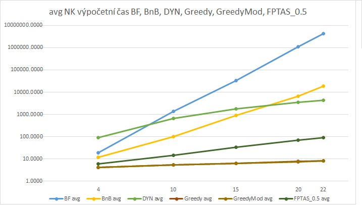

# NI-KOP, 2. úkol

Jan Bittner (bittnja3)

## Zadání úlohy

Úkolem je vytvořit program, který řeší kostruktivní verzi problému batohu hrubou silou (*BF*), metodou větví a hranic (*B&B*), dynamickým programováním (*dyn*), greedy algoritmem (*greedy*), modifikovaným greedy algoritmem (*greedyMod*) a FPTAS (*FPTAS*).

## Spuštění programu

Program lze zkompilovat pomocí `make compile` a následně spustit pomocí `./program.out <method> <file>`, tj. např. `./program.out greedy data/NR/NR4_inst.dat`.

1. `method` – `bf`, `bnb`, `dyn`, `greedy`, `greedyMod`, `fptas`
1. `file` – soubor nebo soubory ke zpracování

## Použité prostředky

### Programovací jazyky a software

Úloha byla řešena v jazyce C++ na operačním systému Windows 10.

Měření bylo spuštěno z *Bashe* prostřednictvím prostředí WSL 2 (*Windows Subsystem for Linux 2*), které využívá *Ubuntu 20.04.1 LTS*, nebylo tedy pro spuštění použito IDE.

Na zachycení aktuálního času bylo využito `std::chrono::high_resolution_clock::now()`.

### Konfigurace testovacího stroje

Testování bylo provedeno na *Legion 5 15ARH05H*. Stroj obsahuje CPU *AMD Ryzen 7 4800H @ 2.90 GHz* a RAM *DDR4 16.00 GB*.

## Rozbor možných variant řešení

Podle zadání mohly být implementovány řešení *BF* a *BnB*  rekurzivním algoritmem nebo iterativně. Využil se rekurzivní přístup.

Podle zadání byly implementovány řešení greedy heuristiky a modifikované heuristiky. Ty se provedly iterativním přístupem.

Metoda dynamického programování mohla být provedena buď rekurzí, nebo pamatováním si (ukládáním si) již vypočítaných hodnot. To se navíc dá implementovat dekompozicí podle ceny a podle váhy.

U metody FPTAS byla použita metoda dynamického programování s dekompozicí podle ceny.

Předpokladem je, že metody *greedy* a *greedyMod* budou nejrychlejší, avšak budou mít větší chybovost při sestavení nejlepšího řešení.

## Rámcový popis postupu řešení

U *greedy metod* se využívá vytvoření kopie dat s hodnotou cena/hmotnost a následným seřazením. Ze seřazeného pole se poté postupně přidávají položky do výběru, pokud nějaká položka nesplňuje podmínky (vejde se do batohu), přeskočí se.

U *modifikované greedy metody* se navíc výsledek greedy metody porovná s nejdražší věcí (která se vejde do batohu) a vybere se lepší možnost.

U metody *dynamického programování* bylo využito řešení s tabulkou a s pamatováním (jinak by nebyla metoda efektivní) a dekompozicí podle ceny. Tabulka se nejprve předpočítá, poté se z dat zjistí požadovaná hodnota a následně je zpětně zjištěna příslušnost jednotlivých předmětů do konfigurace batohu.

Byla použita právě dekompozice podle ceny, aby se dala metoda využít i pro následující metodu *FPTAS*.

U metody *FPTAS* se využívá modifikace metody *dynamického programování* s dekompozicí podle ceny. Podle rovnic ze zadání se upraví předměty a toto modifikované pole je předáno k řešení metodě *dynamického programování*.

Pro všechny metody se počítá čas. Jednotlivé časy instancí jsou zprůměrovány v rámci jedné sady (resp. souboru).

## Popis kostry algoritmu

Pro *greedy* metodu se využívá iterativního průchodu upraveného pole s hodnotami `cena/hmotnost` a postupně se vybírají předměty tak, aby se nepřesáhla kapacita batohu.

Řešení metody *dynamického programování* se opírá o algoritmus řešení metody dynamického programování ze cvičení a přednášky. Vytvoří se tabulka o velikosti `počet věcí * celková možná cena`. Následně se celá tabulka vyplní. Triviálně se před tím předvyplní sloupec pro první předmět (přidán a nepřidán). Z výsledné tabulky se určí maximální možná cena batohu, jakožto řádek posledního sloupečku, který jako první prezentuje váhu menší nebo rovnu kapacitě batohu.

Metodou *FPTAS* se zjednoduší problém dodávaný k řešení metodě *dynamického programování*. Metoda dostane požadovanou relativní chybu `ε`, `0 < ε <= 1`. Metoda určí maximum z cen a vypočítá hodnotu `k`, `k = (ε * maxCost) / n`, která se následně použije pro vytvoření nového pole věcí s cenou `floor(c_i / k)`. Z výsledku zjistíme konfiguraci nového pole věcí a sestavíme podle něj cenu dodaného pole věcí.

## Naměřené výsledky

Podle měření se ukázalo, že metoda *dynamického programování* je pomalejší než heuristické greedy metody, což je způsobeno na úkor nepřesnosti u heuristik. Avšak po využití FPTAS přišlo výrazné zrychlení.

Uvedené časy jsou v `µs`.

První dva grafy zobrazují porovnání výpočeního času všech metod na sadě NK, zvlášť pro průměr a maximální hodnoty:

Další dva grafy zobrazují porovnání výpočeního času všech metod na sadě ZKC, zvlášť pro průměr a maximální hodnoty:

Další dva grafy zobrazují porovnání výpočeního času všech metod na sadě ZKW, zvlášť pro průměr a maximální hodnoty:

Další grafy zobrazují reakci jednotlivých metod na testovací sady NK, ZKC a ZKW:

Následující grafy ukazují vývoj průměrné a maximální chyby FPTAS:

Následující grafy ukazují vývoj průměrné a maximální chyby greedy a modifikované greedy metody:

Poslední graf porovnává chybovost všech metod:

## Závěr

Dle zadání a postupů z přednášek a cvičení byly implementovány metody *greedy heuristiky*, *modifikované greedy heuristiky*, *dynamického programování pomocí tabulky*, *FPTAS* a metody *BF* a *BnB*.

Z měření bylo pozorováno, že metoda *dynamického programování* se řádově zrychlí s použitím *FPTAS*. Z pseudopolynomiální složitosti metody *dynamického programování* dělá FPTAS *polynomiální*.

Jednotlivé testovací sady ovlivňují rychlost zejména metody *BnB* a *FPTAS*, u obou je nejpomalejší sada ZKW, která má hodně instancí s věcmi s váhou přesahující maximum a má obecně jiný počet prvků než předchozí sady.

Z naměřených hodnot vyplývá, že pro řešení bez chyby je v průměru  nejlepší metoda *dyn*.

Můžeme si také povšimnout, že i při malém snížení `ε` je na úkor malého zhoršení chybovosti zrychlen čas výpočtu. Z měření jde také vidět, že metody greedy heuristiky jsou pro větší počet věcí chybové oproti optimálnímu řešení kolem 50 %, avšak jsou nejrychlejší z implementovaných metod.
