= NI-KOP, 3. úkol

Jan Bittner (bittnja3)

== Zadání úlohy

Úkolem je prozkoumat citlivost metod řešení problému batohu na parametry instancí -- poměru kapacity batohu k sumární váze; korelaci cena/váha; rozložení vah a granualitu.

== Použité prostředky

=== Programovací jazyky a software

Úloha byla řešena v jazyce C++ na operačním systému Windows 10.

Měření bylo spuštěno z *Bashe* prostřednictvím prostředí WSL 2 (*Windows Subsystem for Linux 2*), které využívá *Ubuntu 20.04.1 LTS*, nebylo tedy pro spuštění použito IDE.

Na zachycení aktuálního času bylo využito `std::chrono::high_resolution_clock::now()`.

=== Konfigurace testovacího stroje

Testování bylo provedeno na *Legion 5 15ARH05H*. Stroj obsahuje CPU *AMD Ryzen 7 4800H @ 2.90 GHz* a RAM *DDR4 16.00 GB*.

== Řešení

Nejprve jsem prozkoumal citlivost metod na parametry generovaných instancí. Řešení metodou hrubé síly, větví a hranic a dynamického programování jsou exaktní metody, a tedy vždy najdou optimální řešení. Je tedy vhodné zkoumat závislost na výpočetním času .U heuristiky je vhodné zkoumat závislost na kvalitě / relativní chybě.

=== Hrubé síly

Řešení metodou hrubou silou (_bf_) je řešeno rekurzí a prochází vždy všechny možné stavy stavového prostoru. Díky tomu může být výpočetní náročnost závislá pouze na _velikosti instance_.

=== Metoda větví a hranic

Řešení metodou větví a hranic (_bnb_) je řešeno ořezáváním zespoda (další větve nepřinesou lepší výsledek) a zezhora (další věci přeplní batoh). Díky tomu lze předpokládat, že bude tato metoda citlivá na _poměr kapacity batohu k sumární váze_ a _granulitě_.

=== Metoda dynamického programování

Metoda dynamického programování (_dyn_) je řešena pamatováním si již vypočítaných hodnot dekompozicí podle ceny. Díky tomu lze předpokládat že metoda bude záviset na parametru _maximální ceny_.

=== Heuristika

Heuristika je řešena vytvořením kopií dat s hodnotou `cena/hmotnost`  a následným seřazením. Z seřazeného pole se poté postupně přidávají položky do výběru, pokud nějaká položka nesplňuje podmínky (vejde se do batohu), přeskočí se.

Pro tuto metodu je vhodné zkoumat kvalitu. Předpokladem je závislost na _poměru kapacity batohu k sumární váze_.

== Naměřené výsledky

=== Parametr maximální váhy

- Počet věcí: 15
- Počet instancí: 200
- Poměr kapacity batohu k sumární váze: 0.8
- *Max. váha: 100--1000*
- Max. cena: 500
- Exponent granularity: 1

[.text-center]
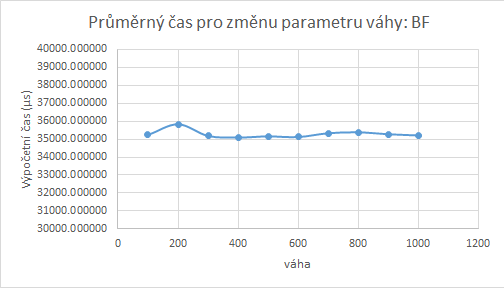
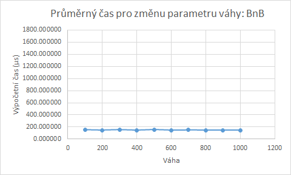
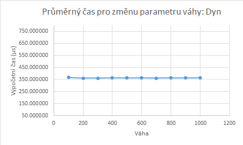

=== Parametr maximální ceny

- Počet věcí: 15
- Počet instancí: 200
- Poměr kapacity batohu k sumární váze: 0.8
- Max. váha: 500
- *Max. cena: 100--1000*
- Exponent granularity: 1

[.text-center]
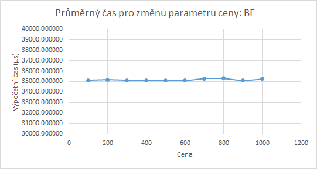
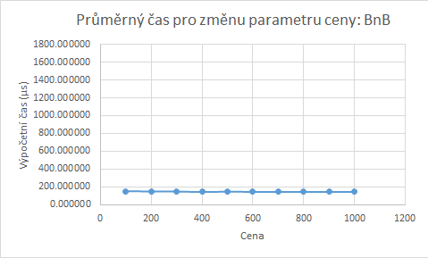
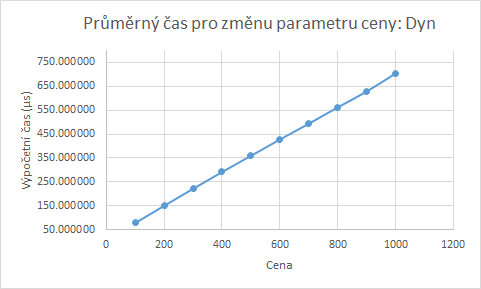

=== Parametr poměru kapacity batohu k sumární váze

- Počet věcí: 15
- Počet instancí: 200
- Poměr kapacity batohu k sumární váze: 0.8
- *Poměr kapacity batohu k sumární váze: 0.1--1.0*
- Max. váha: 500
- Max. cena: 500
- Exponent granularity: 1

[.text-center]
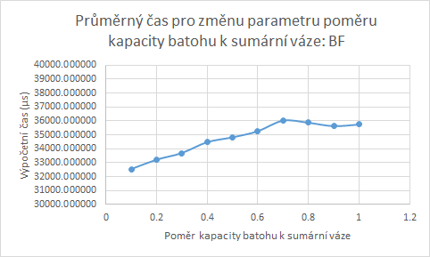
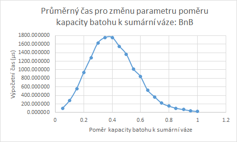
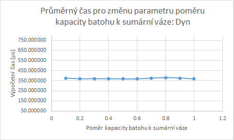

=== Parametr korelace s váhou

- Počet věcí: 15
- Počet instancí: 200
- Poměr kapacity batohu k sumární váze: 0.8
- *Max. váha: 100--1000*
- Max. cena: 500
- *Korelace s váhou: uni | corr | strong*
- Exponent granularity: 1

[.text-center]
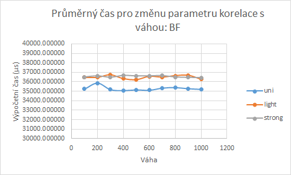
image:corr_bnb.png[]
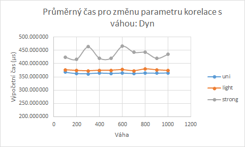

=== Parametr exponentu granularity

- Počet věcí: 15
- Počet instancí: 200
- Poměr kapacity batohu k sumární váze: 0.8
- Max. váha: 500
- Max. cena: 500
- *Převaha věcí: bal | light | heavy*
- *Exponent granularity: -5--5*

[.text-center]
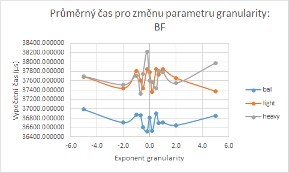
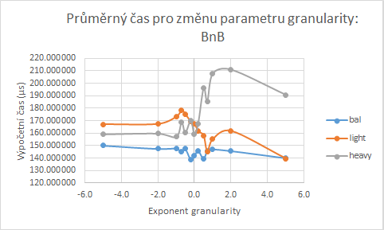
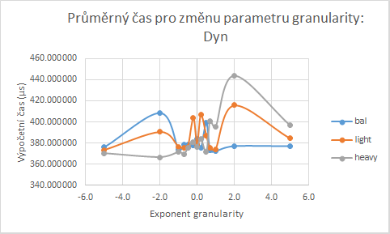

=== Parametr poměru kapacity batohu k sumární váze: relativní chyba heuristiky

- Počet věcí: 15
- Počet instancí: 200
- Poměr kapacity batohu k sumární váze: 0.8
- *Poměr kapacity batohu k sumární váze: 0.1--1.0*
- Max. váha: 500
- Max. cena: 500
- Exponent granularity: 1

[.text-center]
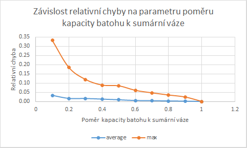

=== Parametr exponentu granularity: relativní chyba heuristiky

- Počet věcí: 15
- Počet instancí: 200
- Poměr kapacity batohu k sumární váze: 0.8
- Max. váha: 500
- Max. cena: 500
- *Převaha věcí: light | heavy*
- *Exponent granularity: 0 0.2 0.5 0.7 1 2 5*

[.text-center]
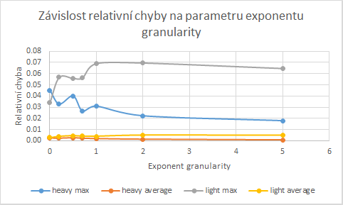

== Závěr

Z naměřených dat, jak je vidět z grafů, lze usoudit, že výpočetní složitost metod bf, bnb ani dyn nejsou závislé na změně parametru maximální váhy. To je očekávané chování vůči znalosti jak algoritmy fungují.

Z grafů jde vidět, že výpočetní složitost metody dynamického programování je závislá na parametru maximální ceny. To souhlasí se stanoveným předpokladem, jelikož doba běhu algoritmu je přímo závislá na velikosti vyplňované tabulky. U metody hrubou silou a větví a hranic žádnou závislost na tomto parametru nepozoruji.

Při zkoumání závislosti výpočetní složitosti na parametru poměru kapacity batohu k sumární váze vidíme, že metoda větví a hranic je na tomto parametru závislá; dle předpokladu. Pro poměru kapacity a sumární váhy okolo hodnoty 0.4 je tento algoritmus nejpomalejší. Naopak s čím vyšší či čím nižší hodnotou se algoritmus zrychluje. To je způsobené právě vlivem ořezávání. U metod hrubou silou a dynamického programování žádnou závislost na tomto parametru nepozoruji.

Z grafů závislosti výpočetní složitosti na parametru korelace s váhou bylo zjištěno, že metody větví a hranic pro menší i silnou korelací s váhou pomalejší vyhodnocování. Dle měření se konstantně složitost zvýšila. U metody dynamického programování je pro silnou korelaci s váhou lehce pomalejší vyhodnocování.

Dle měření granularity zřejmě žádná výrazná závislost u metod hrubou silou, větví a hranic a dynamického programování není. Zdá se ale, že u všech metod je lehce pomalejší vyhodnocení při převaze lehkých či těžkých věcí. U metody dynamického programování je výpočet lehce pomalejší pro hodnotu exponentu kolem bodu 2.0, pro převahu lehkých i těžkých věcí. Pro metodu větví a hranic je výpočet lehce pomalejší kolem bodu 2.0 pro převahu těžkých věcí. Dle měření však nejde předpokládat obecně platná závislost.

Z meření relativní chyby heuristiky pro případ zkoumání parametru poměru kapacity batohu k sumární váze vyplývá, že chyba heuristiky klesá při vyšších hodnotách poměru. Pro nízké hodnoty může relativní chyba dosahovat hodnot okolo 35 %, proto pro ně není metoda vhodná. Naopak pro poměr nad 50 % má metoda relativní chybu zhruba pod 10 % a dále klesá pro vyšší hodnoty poměru. Pro vyšší hodnoty poměru je tedy metoda vhodná.

Z měření relativní chyby heuristiky pro případ zkoumání parametru exponentu granuality vidíme, že chyba mírně roste při vyšší granualitě, tedy při menším počtu malých věcí.

Z naměřených dat a dle jejich grafů nám tedy vyplývá, že metoda hrubé síly není závislá na parametrech (kromě počtů věcí v instanci), ale je nejpomalejší a tedy vhodná jen pro malé instance. Metoda větví a hranic je rychlá pro malé nebo velké poměry kapacity batoku k sumární váze. Metoda dynamického programování je rychlá, ale je závislá na váze předmětů a svou implementací spotřebovává velké množství paměti. Metoda je tedy vhodná zejména pro batohy s nízkými cenami. Heuristika je nejrychlejší metoda, avšak u speciálních batohů je možnost větších chyb. Metoda je nejvhodnější pro batohy s poměrem kapacity batohu k sumární váze blížící se hodnotě 1.
