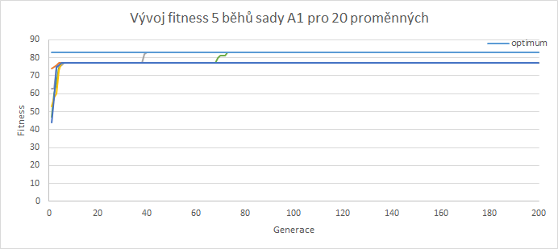

= NI-KOP, 5. úkol

Jan Bittner (bittnja3)

== Zadání úlohy

Úkolem je prozkoumat pomocí evolučního algoritmu zadanou booleovskou formuli `F` o `n` proměnných `X=(x1, x2, ..., xn)` v konjunktivní normální formě a vyřešit přiřazení `Y=(y1, y2, ..., yn)` proměnných `x1, x2, ..., xn` pro zadané kladné váhy proměnných `W=(w1, w2, ..., wn)` tak, že `F(Y) = 1` a součet `S` vah proměnných, které jsou nastaveny na jedinčku, je maximální. Úloha je omezena na 3-SAT problém.

== Použité prostředky

=== Programovací jazyky a software

Úloha byla řešena v jazyce C++ na operačním systému Windows 10.

Měření bylo spuštěno z *Bashe* prostřednictvím prostředí WSL 2 (*Windows Subsystem for Linux 2*), které využívá *Ubuntu 20.04.1 LTS*, nebylo tedy pro spuštění použito IDE.

Na zachycení aktuálního času bylo využito `std::chrono::high_resolution_clock::now()`.

Program je možné zkompilovat pomocí `make compile` a následně spustit s parametrem souboru a souborem s optimálními hodnotami, např. `./program.out data/wuf-20-78/file.mwcnf data/wuf20-78-M-opt.dat`.

=== Konfigurace testovacího stroje

Testování bylo provedeno na *Legion 5 15ARH05H*. Stroj obsahuje CPU *AMD Ryzen 7 4800H @ 2.90 GHz* a RAM *DDR4 16.00 GB*.

== Algoritmus

Zvoleným algoritmem je *genetický algoritmus*. Algoritmus se inspiruje evolučními procesy v přírodě a postupnou iterací zlepšuje množinu řešení populace pomocí operací selekce, křížení a mutace.

Byla zvolená *generational metoda*, která v každé iteraci vygeneruje novou populaci pomocí operací nad předchozí generací. Celý proces naznačuje následující pseudokód:

. Vytvoř výchozí populaci `P`.
. N-krát opakuj:
.. Vytvoř novou populaci `P*`.
.. *Elitismus*: vyber `e` nejlepších jedinců z populace `P` a vlož je do `P*`.
.. *Selekce*: z populace `P` vyber rodiče.
.. *Křížení*: s rodiči prověď křížení.
.. *Mutace*: s potomky prověď mutaci.
.. Přidej potomky do populace `P*`.
.. Nahraď původní populaci `P = P*`.
. Jedinec z populace `P*` s nejlepší hodnotou *fitness* je řešením.

=== Jedinec

Jedinec je chromozom, který se skládá z genů (bit vector), a reprezentuje nějaké řešení problému. Kvalitu řešení reprezentuje *fitness* jedince.

=== Populace

Populace je množina jedinců. Jedinci jsou v populaci seřazeni podle jejich *fitness* a jsou na ně aplikovány operace *křížení* a *mutace*. Počáteční populace je generována náhodně, navíc jsou přidány případy se všemi bity nastavenými na hodnotu 0 a 1.

=== Fitness

Fitnes určuje kvalitu řešení daného chromozomu a pro případ 3SAT odpovídá fitness hodnotě součtu vah proměnných (genů), které jsou nastaveny na jedničku. Chromozomy které nereprezentují řešení, tedy `F(Y) = 0`, jsou penalizovány za každou nesplněnou klauzuli dané formule.

=== Elitismus

Elitismus je metoda, která zajistí, že se do nové generace dostane `e` jedinců s nejlepší hodnotou *fitness*. Tím se docílí přežití malého množství kvalitních jedinců. Hodnota `e` by měla být co nejmenší, aby se předešlo degeneraci populace.

=== Selekce

Selekce určuje výběr rodičů z předchozí populace, na které jsou dále aplikovány operace *křížení* a *mutace*. Byla implementována náhodná selekce a pro ovlivnění selekčního tlaku následně selekce turnajem. Náhodná selekce je speciální případ pro selekci turnajem kdy parametr turnaje je roven 1. Metoda turnaje náhodně vybere z populace `N` jedinců, které seřadí podle hodnoty *fitness* a vybere nejlepšího z nich.

Selekční tlak je pravděpodobnost výběru nejlepšího jedince. Malý selekční tlak způsobuje pomalou konvergenci a naopak velký selekční tlak může způsobit degeneraci populace.

Výběr dvou rodičů a jejich zpracování křížením a mutací je implementováno standardním algoritmem a byla také implementována metoda *deterministic crowding*. V metodě *deterministic crowding* mezi sebou bojují dva rodiče a jejich potomci, kteří vznikli křížením a případnou mutací. O tom, kdo se přidá do populace, rozhoduje vzdálenost dvojic rodič, potomek.

=== Křížení

Křížení je operace, která kříží geny dvou jedinců do dvou potomků. Byla implementována metoda jednobodového křížení a uniformního křížení. Křížení způsobuje vznik nových jedinců do populace.

Jednobodové křížení náhodně zvolí bod a geny do této pozice jsou zkopírovány z prvního rodiče, geny od této pozice jsou zkopírovány z druhého rodiče. A naopak pro druhého potomka.

Uniformní křížení oproti jednobodovému křížení nepracuje s sekcí chromozomu, ale s každým genem zvlášť. Metoda náhodně vygeneruje bit vector a pro každý gen potomka určuje daný bit rodiče, od kterého si gen zkopíruje. Naopak pro druhého potomka.

=== Mutace

Mutace je operace, která upraví náhodný gen chromozomu, čímž pomáhá proti degeneraci populace.

=== Vylepšení

Oproti klasickému algoritmu byly implementovány metody pro vylepšení výsledků. Bylo implementováno řešení pomocí restartování populace dvěma způsoby. První případ nastává v situaci, kdy algoritmus uvázne v lokálním maximu bez nalezeného řešení, v takovém případě se resetuje celá populace. Druhý případ nastává v situaci, kdy algoritmus našel nějaké řešení a uvázl nějakém maximu. Algoritmus neví, zda-li našel optimální řešení či ne, proto se resetuje celá populace kromě jedince s nějvětší hodnotou fitness.

== Testovací sady

Testování probíhalo na přiložených testovacích sadách:

* `wuf-M1`, `wuf-N1` -- Váhy by měly podporovat nalezení řešení. Heuristika, která řeší určitou instanci v sadě wuf-M, by měla řešit odpovídající instanci v sadě wuf-N stejně snadno. Vzhledem k počtu řešení jednotlivých instací (až 108), není možné efektivně najít optimální řešení.
* `wuf-Q1`, `wuf-R1` -- Jako výše, váhy ale vytvářejí (mírně) zavádějící úlohu.
* `wuf-A1` -- z dílny prof. Zlomyslného. Instance vycházejí z nezkrácených (nebo jen mírně zkrácených) instancí, takže jsou obtížné. Váhy vytvářejí zavádějící úlohu. Nicméně, malý počet řešení dovoluje ve většině případů uvést optimální řešení.

<<<
== Prvotní testování sad

=== Testování

Nejdříve bylo provedeno testování na různých sadách, s různým počtem proměnných a různým rozložením vah. Toto testování bylo provedeno s předpokladem, že testováním na širokém spektru dat se podaří lépe odhalit možnosti vylepšení či dokonce závažné chyby. V této sekci tedy bude zkoumána funkčnost algoritmu v jednotlivých výše uvedených sadách a případné odhalené nedostatky budou v další kapitole odstraněny. Pro detailní zkoumání grafu byla vybrána jedna instance z jedné sady. Bylo ověřeno, že obdobně se chovají ostatní instance z dané sady. Na každé instanci bylo provedeno 5 běhů a je zkoumán vývoj nejlepšího jedince na základě generace.

Výchozí parametry pro testovací měření byly zvoleny intuicí či podle zkušenosti z minulé úlohy. Tato měření využívá jednobodové křížení a standardní implementaci výběru rodičů.

[%header,cols=2*]
|===
|Parametr
|Hodnota

|Velikost počáteční populace
|500

|Velikost populace
|200

|Počet generací
|200

|Velikost turnaje
|10

|Elitismus
|2

|Pravděpodobnost křížení
|80 %

|Pravděpodobnost mutace
|40 %
|===

<<<
=== Sada M1

Sada M1 je sada podporující nalezení řešení. Pro 20 proměnných algoritmus našel optimální řešení vždy. Pro 50 proměnných našel algoritmus vždy řešení, ale ne nutně optimální. Z grafu s 50 proměnnými vidíme, že graf se jednou dostal do lokálního extrému, ze kterého se úspěšně dostal resetováním.

Z grafů se zdá, že algoritmus najde řešení příliš rychle, což může vést k uváznutí v lokálním maximu. Bylo by tedy vhodné později prozkoumat parametr selekčního tlaku.

[%header,cols=4*]
|===
| Počet proměnných
| Průměrná čas (v ms)
| Průměrná relativní chyba
| Maximální relativní chyba

| 20
| 8209.8
| 0.0
| 0.0

| 50
| 19778.4
| 0.012
| 0.032
|===

image::initial/M1-50.png[align="center"]

<<<
=== Sada N1

Sada N1 je sada podporující nalezení řešení. Pro 20 proměnných našel algoritmus optimální řešení vždy. Pro 50 proměnných algoritmus našel řešení, ale ne nutně optimální.

[%header,cols=4*]
|===
| Počet proměnných
| Průměrná čas (v ms)
| Průměrná relativní chyba
| Maximální relativní chyba

| 20
| 8511.6
| 0.0
| 0.0

| 50
| 19511.8
| 0.020
| 0.037
|===

<<<
=== Sada Q1

Sada Q1 vytváří mírně zavádějící úlohu svým nastavením vah. Pro 20 proměnných bylo nalezeno optimální řešení vždy. Z druhého grafu pro 50 proměnných je však vidět, že byl nalezen problém, jelikož ani jeden běh úspěšně nenašel řešení.

Z grafu lze vidět, že může být problém s hodnotou penalizace nevalidních řešení, tj. jedinců, kteří neplní všechny klauzule formule. Tito jedinci dokonce získávají vyšší hodnotu fitness než optimální řešení, což značí chybu zvolené hodnoty. Jedinci, kteří neposkytují řešení, jsou v této variantě algoritmu penalizováni hodnotou `- notEvaluatedClausolesCount * maxWeight`. Tato hodnota je zjevně nevhodně zvolená, proto bude potřebovat upravit.

Na grafu s 20 proměnnými jde vidět, že by bylo vhodné upravit parametr selekčního tlaku.

<<<
=== Sada R1

Sada R1 je obdobná sadě Q1. Obdobné jsou i problémy výše zmíněné. Na této sadě algoritmus nenašel řešení ani pro 20 proměnných, ani pro 50 proměnných. Problém je zřejmě stále nevhodně zvolená hodnota penalizace.

<<<
=== Sada A1

Sada A1 je z dílny prof. Zlomyslného a váhy vytvářejí zavádějící úlohu. I přes neúspěch algoritmu na sadě Q1 a R1, na sadě A1 obvykle algoritmus najde řešení, ne vždy však optimální.

[%header,cols=3*]
|===
|Průměrná čas (v ms)
|Průměrná relativní chyba
|Maximální relativní chyba

| 9156.6
| 0.043
| 0.072
|===

<<<
== Testování upraveného algoritmu

V předchozí kapitole bylo provedeno testování sad pro první verzi algoritmu. Testováním a pozorováním bylo objeveno několik vad, které je nutné zlepšít. Pro to, aby algoritmus zejména našel nějaké řešení je nutné zvolit přísnější hodnotu pro penalizaci jedinců, kteří nejsou řešením formule. Dále je vhodné zvolit menší hodnotu pro čekání na reset populace při uváznutí. Cílem úpravy algoritmu je aby algoritmus našel nějaké řešení pro instance všech sad.

Testování probíhá na stejné konfiguraci parametrů a na stejném principu jako předešlé testování.

<<<
=== Sada M1

Této sadě se po úpravě algoritmu lehce zvýšila relativní chyba. I tak ale najde vždy řešení, většinou i optomální.

[%header,cols=4*]
|===
| Počet proměnných
| Průměrná čas (v ms)
| Průměrná relativní chyba
| Maximální relativní chyba

| 20
| 8114.6
| 0.012
| 0.032

| 50
| 19391.8
| 0.025
| 0.093
|===

<<<
=== Sada N1

Této sadě se snížila relativní chyba a i s 50 proměnnými nyní najdou téměř vždy optimální hodnotu. S 20 proměnnými najdou optimální hodnotu vždy.

[%header,cols=4*]
|===
| Počet proměnných
| Průměrná čas (v ms)
| Průměrná relativní chyba
| Maximální relativní chyba

| 20
| 8144.8
| 0.0
| 0.0

| 50
| 19416.6
| 0.002
| 0.008
|===

image::second/N1-50.png[align="center"]

<<<
=== Sada Q1

Úprava algoritmu této sadě velmi prospěla. Algoritmus již nalézá řešení, což bylo cílem úpravy algoritmu, i když ne vždy optimální.

[%header,cols=4*]
|===
| Počet proměnných
| Průměrná čas (v ms)
| Průměrná relativní chyba
| Maximální relativní chyba

| 20
| 8119.4
| 0.050
| 0.083

| 50
| 19421
| 0.118
| 0.220
|===

<<<
=== Sada R1

Úprava algoritmu přinesla velké zlepšení i pro tuto sadu. Při 20 i 50 instancích předchozí algoritmus nenacházel řešení. Nyní řešení nachází. Při 20 proměnných nachází optimální s velmi malou relativní chybou. Naopak při 50 proměnných dosahuje cca 40% relativní chyby od optima. Algoritmus se snaží restartovat populaci, kromě nejlepšího jedince, avšak ani tato metoda nedosahuje požadovaného výsledku, tedy zmenšení relativní chyby.

[%header,cols=4*]
|===
| Počet proměnných
| Průměrná čas (v ms)
| Průměrná relativní chyba
| Maximální relativní chyba

| 20
| 8272.4
| 0.001
| 0.007

| 50
| 19630.8
| 0.404
| 0.458
|===

<<<
=== Sada A1

Úravy algoritmu, zdá se, nemají vliv na sadu A1. Relativní chyba, průměrná i maximální, zůstala identická. Algoritmus najde řešení vždy, ne vždy však optimální hodnotu.

[%header,cols=3*]
|===
|Průměrná čas (v ms)
|Průměrná relativní chyba
|Maximální relativní chyba

| 9024
| 0.043
| 0.072
|===

=== Shrnutí

Algoritmus se povedlo navrhovanými úpravami opravit, nyní již nachází řešení pro všechny sady.

<<<
== Vliv parametrů a metod

V této kapitole bude cíl najít nejvhodnější parametry pro algoritmus.
Výchozí parametry jsou v tabulce níže. Postupně se budou upravovat dle výsledků měření a pokusů. Jednotlivé grafy zobrazují hodnoty relativní chyby. Výsledky jsou průměrem běhů nad 20 různými instancemi z každé sady.

[%header,cols=2*]
|===
|Parametr
|Hodnota

|Velikost počáteční populace
|500

|Velikost populace
|200

|Počet generací
|200

|Velikost turnaje
|10

|Elitismus
|2

|Pravděpodobnost křížení
|80 %

|Pravděpodobnost mutace
|40 %
|===

<<<
=== Vliv křížení

Bylo implementováno jednobodové křížení, uniformní křížení a navíc kombinace předchozích způsobů na základě 50% pravděpodobnosti. Každý způsob křížení je jinak vhodný na určité problémy. Ukázalo se však, že nejlépe si celkově vede v průměru i maximální relativní chybě uniformní křížení s průměrnou relativní chybou 0.1068. Srovnatelně hůře na tom je následně jednobodové křížení a kombinované křížení. Zvolena byla tedy metoda uniformního křížení.

<<<
=== Vliv elitismu a velikosti turnaje

Elitismus určuje, zda a kolik nejlepších jedinců automaticky přejde do nové generace. Velikost turnaje určuje selekční tlak. Bude se zkoumat vliv elitismu (hodnoty 0, 1, 2) při velikosti turnaje (hodnoty 3 a 10). Je předpoklad, že elitismus bude potřeba nastaven, jelikož nám zachovává jedince blížícího se optimu.

Pro elitismus = 0, což znamená že nepřenášíme nejlepšího jedince do další generace, byly naměřeny nejhorší průměrné i maximální relativní chyby. Navíc, pro několik běhů algoritmu nebylo ani nalezeno řešení. Lze vidět, že pro větší turnaj je průměrná chyba nižší, což je s předpokladem -- vybíráme nejlepší ohodnocení z více jedinců, tudíž máme větší šanci vybrat nejlepšího.

Pro elitismus 1 a 2 nastává při změně turnaje z 10 na 3 mírné zlepšení. Stejně tak nastává mírné zlepšení při přechodu elitismu z 2 na 3. Nejoptimálnější hodnota dle měření je tedy elitismu = 2, turnaj = 3.

<<<
=== Vliv způsobu selekce

Byl zkoumán vliv způsobu selekce. Předpokladem bylo, že bude metoda *deterministic crowding* vhodnější, jelikož by měla umožňovat přidávat do populace jedince na základě podobnosti. Měřením a ani žádnou další dodatečnou modifikací parametrů (např. pravděpodobnosti křížení a mutace) se nepodařilo tento předpoklad potvrdit.

<<<
=== Vliv pravděpodobnosti křížení

Pravděpodobnost křížení určuje šanci, s jakou se rodiče skříží a vytvoří novou variantu potomka, v tomto případě pomocí jednobodového křížení. Předpoklad je, že by se měla ideální pravděpodobnost blížit k 1, pro rozvoj populace a dobrání se výsledku.

Z naměřených dat jde vidět, že nejlepší hodnoty relativní chyby dosahuje algoritmus v okolí 70 %.

image::params/crossover.png[align="center"]

<<<
=== Vliv pravděpodobnosti mutace

Pravděpodobnost mutace ovlivňuje náhodné prohození genu jedince. To umožní náhodné rozšíření populace o nového jedince. Předpokladem je, že by tato hodnota měla být spíše malá, jinak může mít vliv na degeneraci populace přílišným mutováním.

Nejlepší výsledky se naměřily okolo hodnoty 30 %.

image::params/mutation.png[align="center"]

<<<
== Finální přehled testování

V této kapitole je zobrazen přehled finálně nastaveného algoritmu. Jsou použity parametry zobrazy v tabulce níže. Testování probíhá na stejném principu jako předešlé testování.

[%header,cols=2*]
|===
|Parametr
|Hodnota

|Velikost počáteční populace
|500

|Velikost populace
|200

|Počet generací
|200

|Velikost turnaje
|3

|Elitismus
|2

|Pravděpodobnost křížení
|70 %

|Pravděpodobnost mutace
|30 %
|===

<<<
=== Sada M1

Pro sadu M1 se povedlo zlepšit relativní chybu, pro 20 proměnných je chyba 0 a najde tedy vždy optimální řešení. Pro 50 proměnných se relativní chyba taktéž změnčila a algoritmus najde optimální řešení častěji.

[%header,cols=4*]
|===
| Počet proměnných
| Průměrná čas (v ms)
| Průměrná relativní chyba
| Maximální relativní chyba

| 20
| 4510.4
| 0.000
| 0.000

| 50
| 10665.8
| 0.004
| 0.012
|===

<<<
=== Sada N1

Pro sadu N1 pro 20 proměnných je ve všech verzích, i této, nalezeno optimální řešení. V této verzi bylo pro 50 proměnných této sady nalezeno optimální řešení vždy, což je oproti druhé verzi zlepšení.

[%header,cols=4*]
|===
| Počet proměnných
| Průměrná čas (v ms)
| Průměrná relativní chyba
| Maximální relativní chyba

| 20
| 4489.4
| 0.000
| 0.000

| 50
| 10631.2
| 0.000
| 0.000
|===

<<<
=== Sada Q1

Sada Q1 dosahuje pro 20 proměnných výrazně lepší průměrné relativní chyby. Pro řešení 50 promměných byla relativní chyba zlepšena druhou verzí a i touto, třetí, verzí byla relativní chyba znatelně zmenšena.

[%header,cols=4*]
|===
| Počet proměnných
| Průměrná čas (v ms)
| Průměrná relativní chyba
| Maximální relativní chyba

| 20
| 4469
| 0.017
| 0.083

| 50
| 10768.8
| 0.089
| 0.122
|===

<<<
=== Sada R1

Sada R1 nenalezla v první verzi algoritmu řešení, ve druhé jej našla s relativní chybou a v této verzi pro 20 proměnných bylo naměřeno optimální řešení vždy. Obdobně i pro verzi s 50 proměnnými, které však nenajde optimální řešení nikdy, ale místo toho konverguje k nějaké hodnotě, která je však blíže optimu než-li u druhé verze algoritmu.

[%header,cols=4*]
|===
| Počet proměnných
| Průměrná čas (v ms)
| Průměrná relativní chyba
| Maximální relativní chyba

| 20
| 4484.8
| 0.000
| 0.000

| 50
| 10691.2
| 0.383
| 0.396
|===

<<<
=== Sada A1

Pro sadu A1 bylo naměřeno optimální řešení vždy.

[%header,cols=4*]
|===
| Počet proměnných
| Průměrná čas (v ms)
| Průměrná relativní chyba
| Maximální relativní chyba

| 20
| 4947.6
| 0.000
| 0.000
|===

<<<
== Závěr

Bylo implementováno řešení 3SAT pomocí genetického algoritmu. Algoritmus navíc využívá strategie restartu při uvíznutí v optimu a při hledání lepšího řešení. Bylo experimentováno s typy křížení (jednobodové a uniformní) a typem selekce (klasické a deterministický crowding).

Po původní implementaci algoritmu bylo provedeno testování na všech sadách, které zkoumalo obecné chování algoritmu. Pro sady Q1 a R1 měl algoritmus velké problémy (řešení nebylo nalezeno), které byly odhaleny a napraveny ve druhé verzi algoritmu, pro které bylo také provedeno kontrolní testování. Následně se přešlo do fáze ladění parametrů, kde byly odhaleny zřejmě nejvhodnější parametry, které byly následně znovu použity na měření vůči všem sadám s finální verzí algoritmu.

Algoritmus se téměř 2x zrychlil po zjištění lepších hodnot parametrů. Z průměrného času 8000 ms při 20 proměnných a 19000 ms při 50 proměnných na průměrný čas 4000 ms při 20 proměnných a 10000 ms při 50 proměnných. Toto zlepšení nastalo zřejmě díky zmenšení parametru velikosti turnaje.

Finální nastavení algoritmu bylo spuštěno na všechny instance s 50 proměnnými (pro sadu A na 20 proměnných) se známým optimálním řešením. Celkově jsou výsledky heuristiky velmi dobré. Celková průměrná relativní chyba řešení je 8 %, celková maximální relativní chyba je 29 %. Dle měření maximální průměrná relativní chyba je 17.87 %. Výsledky jsou tedy velmi uspokojivé a v průměru algoritmus nachází optimální řešení s velkou pravděpodobností. Tabulku měření lze vidět na tabulce níže:

[cols=3*, options="header,footer"]
|===
|Sada (proměnné-klauzule)
|Průměrná relativní chyba
|Maximální relativní chyba

|M1 50-201
|0.0058
|0.1195

|N1 50-201
|0.0020
|0.0237

|Q1 50-201
|0.1787
|0.3955

|R1 50-201
|0.1599
|0.4518

|A1 20-88
|0.0561
|0.4795

|průměrně celkem
|0.0805
|0.2940
|===

Výsledné nastavení parametrů bylo určeno následovně:

[%header,cols=2*]
|===
|Parametr
|Hodnota

|Velikost počáteční populace
|500

|Velikost populace
|200

|Počet generací
|200

|Velikost turnaje
|3

|Elitismus
|2

|Pravděpodobnost křížení
|70 %

|Pravděpodobnost mutace
|30 %
|===
